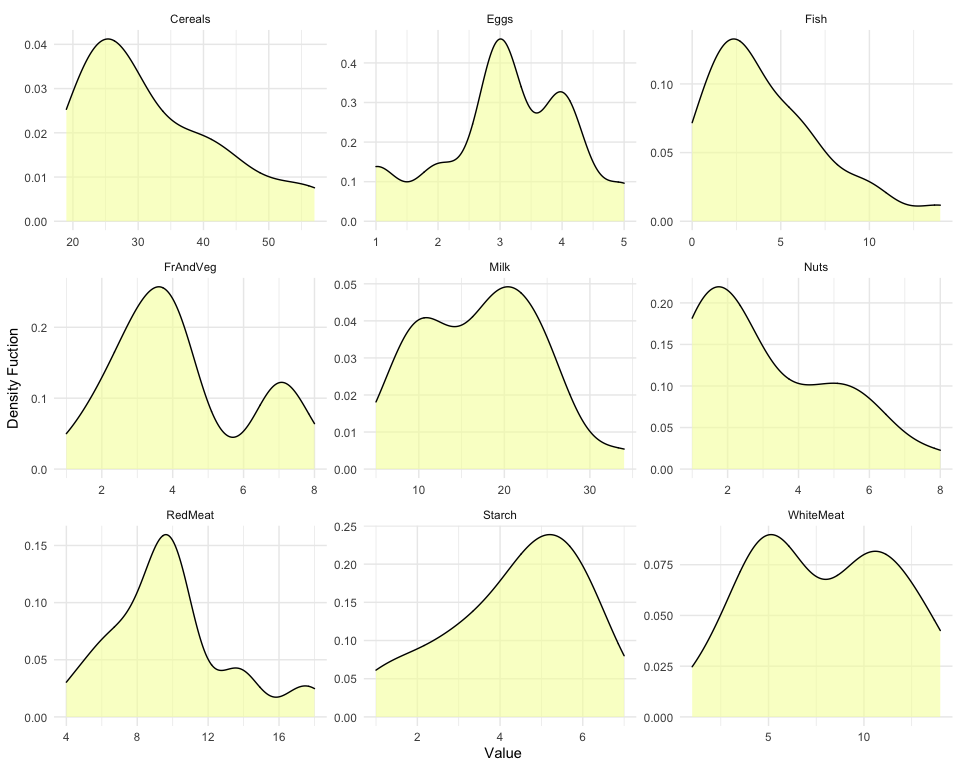
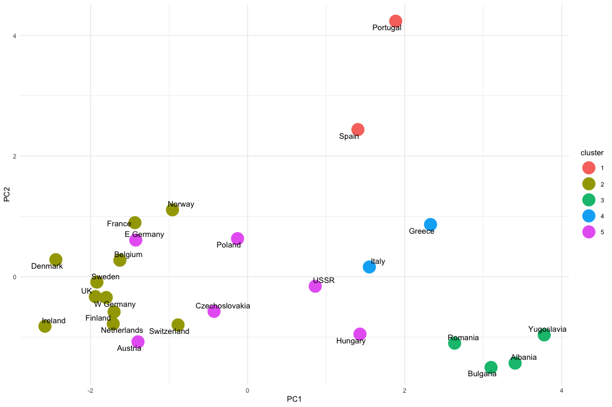

# About Unsupervised Learning/Cluster Analysis

Unsupervised data mining includes methods that discover unknown
relationships in data. With unsupervised data mining, there’s no outcome
that is being predicted; rather, patterns in the data are sought that
perhaps were previously unknown. For example, one may want to find
groups of customers with similar purchase patterns. In some cases,
unsupervised analyses are used as the approach and the knowledge gained
therefrom is presented to stakeholders. In other cases, unsupervised
analyses are used to find relationships and patterns that can, in turn,
be used to build predictive models for efficiently and effectively.

Unsupervised learning algorithms are also referred to as clustering
algorithms. The basic idea is to analyze the shared correlation in the
data we use as an input to the algorithm. Correlation is a well known
way to check if two quantitative variables are related. Cluster
algorithms are more advanced as they consider the correlation between a
set of variables.

What does this mean for how the algorithms relate to our desired
outcome? Our desired outcome is that we are able to group the rows of a
data set together in some novel way such that the rows are related via
the input variables. This means that we need a set of variables that
have interesting variance patterns (more on this a little later). It
also means that we need to be measuring some real set of relationships
AND that we have collected data that accurately represents those
relationships. This means that clustering projects can fail for a few
interesting reasons.

First, a cluster solution can fail (or be difficult to find) because the
population of individuals we’re interested in are homogeneous. I once
worked on a project for a high-end auto manufacturer. It turned out that
a decent solution was difficult simply because the people surveyed
tended to be all in the same income bracket, cared (more or less) about
the same thing, and even shared similar demographic patterns. Similar
phenomena can be found if you’re looking to cluster specific
professions. For example, clustering data collected from doctors can be
tough, especially if there is a focus on specific specialties.

Similarly, data collection can have a large effect on the ability to get
a good cluster solution. I once worked on a project where we were,
again, clustering data collected in a survey. The survey designer had
decided to use a three point agreement scale in the questions that were
to be used as inputs. This was a really bad idea since cluster
algorithms live and die on the variance w/in the data. We would
typically use a five point scale at a minimum and would prefer seven to
eleven points as more points allow for more variance.

### About the data

This is a small dataset from 1973 on protein consumption from nine
different food groups in 25 countries in Europe. The goal is to group
the countries based on patterns in their protein consumption.

References: 1. Zumel, N. and Mount, J. “Practical Data Science with R”,
Manning Publications, 2014.

### Developing a cluster solution

The process of creating a good/usable cluster solution typically
involves a bit of art along with the science. Cluster algorithms produce
different solutions depending on what variables are used as inputs and
can be different under different transformations of the data. By
transformations we mean things like scaling, bucketing, or turning the
variable into binary values. A typical process would go as follows.

1.  Explore the data (via numeric summarise and graphic visualization)
2.  Choose a set of variables
3.  Choose a transformation method (none being a viable option)
4.  Run several cluster algorithms
5.  Evaluate solutions
    -   If there are no viable solutions, go back to step 2 and repeat
6.  Present solution to stakeholders

We will walk through each of these steps throughout the lab and ask
questions along the way.

### Explore the data

One thing often done prior to running a cluster algorithm is to explore
the data. This is first done by examining summary stats as seen below.

    d_protein <- tbl(mm,'protein') %>% collect() # Get data from the database
    summary(d_protein) 

    ##    Country             RedMeat       WhiteMeat          Eggs           Milk            Fish          Cereals          Starch          Nuts         FrAndVeg  
    ##  Length:25          Min.   : 4.0   Min.   : 1.00   Min.   :1.00   Min.   : 5.00   Min.   : 0.00   Min.   :19.00   Min.   :1.00   Min.   :1.00   Min.   :1.0  
    ##  Class :character   1st Qu.: 8.0   1st Qu.: 5.00   1st Qu.:3.00   1st Qu.:11.00   1st Qu.: 2.00   1st Qu.:24.00   1st Qu.:3.00   1st Qu.:2.00   1st Qu.:3.0  
    ##  Mode  :character   Median :10.0   Median : 8.00   Median :3.00   Median :18.00   Median : 3.00   Median :28.00   Median :5.00   Median :2.00   Median :4.0  
    ##                     Mean   : 9.8   Mean   : 7.92   Mean   :3.08   Mean   :17.28   Mean   : 4.28   Mean   :32.32   Mean   :4.36   Mean   :3.08   Mean   :4.2  
    ##                     3rd Qu.:11.0   3rd Qu.:11.00   3rd Qu.:4.00   3rd Qu.:23.00   3rd Qu.: 6.00   3rd Qu.:40.00   3rd Qu.:6.00   3rd Qu.:5.00   3rd Qu.:5.0  
    ##                     Max.   :18.0   Max.   :14.00   Max.   :5.00   Max.   :34.00   Max.   :14.00   Max.   :57.00   Max.   :7.00   Max.   :8.00   Max.   :8.0

These summary stats are fine, but they don’t give us a good picture into
the data. It is often preferred to look at some visualizations of the
data before getting started. The visualization below shows density plots
for each of the variables that we plan on using as inputs into our
clustering algorithm.

A density plot shows you how one column of data varies. Along the x-axis
we see the full range of values that variable can take. The y-axis shows
us how frequently each value occurs in the data. The density plot is,
effectively, a histogram. When creating a histogram, we put the values
of our variable into bins and then we count up how many data points fit
in each bin. There are two primary differences between the histogram and
the density plot. First, the density plot considers what happens when
the bin width goes to zero. Second, the y-axis is transformed into a
density function, so it no longer represents the number of data points.

As mentioned, the density plot gives you a lot of information about what
each variable looks like on its own. See the density plots below for the
data in question.

    density_data <- d_protein %>% #select(Country,RedMeat,WhiteMeat,Eggs,Milk) %>% 
        pivot_longer(cols=-Country,names_to='type')
    ggplot(density_data, aes(x=value)) + 
        geom_density(fill='#F6FEAA',alpha=0.6) + 
        facet_wrap(~type,scales='free') +
        labs(x='Value',y='Density Fuction') +
        theme_minimal() +
        theme(panel.grid.minor.y=element_blank())

### Choose a set of variables

In this example, we are likely to use all of the variables available in
the data set. That is because we don’t have a ton of options and due to
the fact that the problem is quite simple. In other more complex
situations we might choose to leave out certain variables or we might
combine them in novel ways. For example, in this situation, we could
narrow down our set of variables by combining the two meat categories by
taking the row-wise maximum between RedMeat and WhiteMeat.

### Choose a transformation method (none being a viable option)

There quite a few ways to transform data. There are a few ways transform
data that include collapsing rows via some kind of aggregation,
collapsing columns (as discussed earlier), or to modifying the variables
in some way. One very common modification when working with
questionnaire data is to take what is called a Top 2 Box score. If
you’re dealing with some sort of agreement scale with 7 levels, a Top 2
Box score would assign the value 1 to scores 6 and 7 and 0 to all the
lower scores. This is very helpful when evalutaing a solution but can
also be used as an input into the clustering algorithm.

#### Consider units and scaling

Another very common data tranformation is to scale each variable by its
mean and standard deviation. The documentation for this dataset doesn’t
mention what the units of measurement are, though we can assume all the
columns are measured in the same units. However, if we couldn’t make
that assumption, scaling would be come very important. This is
important: units (or more precisely, disparity in units) affect what
clusterings an algorithm will discover. If you measure vital statistics
of your subjects as age in years, height in feet, and weight in pounds,
you will very likely get different clusters if you measure age in years,
height in meters, and weight in kilograms.

This is especially true if you want to cluster something like annual
spend and customer age together. One will be measured in dollars
(possibly tens of thousands of dollars) and the other will max out
around 95 or so. The scales are terribly different and the variability
will be quite different as well.

One way to try to make the clustering more coordinate-free is to
transform all the columns to have a mean value of 0 and a standard
deviation of 1. This makes the standard deviation the unit of
measurement in each coordinate. Assuming that your training data has a
distribution that accurately represents the population at large, then a
standard deviation represents approximately the same degree of
difference in every coordinate. You can scale the data in R using the
function scale().

We’re not using Country in the clustering (because it is not numeric).
The following code will standardize all of the numeric variables.

    var_list <- c("RedMeat", "WhiteMeat", "Eggs", "Milk", "Fish", "Cereals", "Starch", "Nuts", "FrAndVeg") 

    m_protein <- as.data.frame(scale(d_protein[, var_list])) # filters to only the attributes we need and scales them
    names(m_protein) <- paste0('st_',var_list)

    all_protein <- cbind(d_protein,m_protein)

After standardization, we can look at the numerical summary of two
variables to see if it worked. Note that the mean and standard deviation
are now 0 and 1 respectively. This is the case for all of the variables
in the data set.

<table>
<colgroup>
<col style="width: 16%" />
<col style="width: 17%" />
<col style="width: 32%" />
<col style="width: 33%" />
</colgroup>
<thead>
<tr class="header">
<th style="text-align: right;">Mean Red Meat</th>
<th style="text-align: right;">StDev Red Meat</th>
<th style="text-align: right;">Standardized Mean Red Meat</th>
<th style="text-align: right;">Standardized StDev Red Meat</th>
</tr>
</thead>
<tbody>
<tr class="odd">
<td style="text-align: right;">9.8</td>
<td style="text-align: right;">3.40343</td>
<td style="text-align: right;">0</td>
<td style="text-align: right;">1</td>
</tr>
</tbody>
</table>

### Run several cluster algorithms

In this case, we will run what’s called a K-means algorithm. This
algorithm uses a mathematical definition of distance to cluster rows of
data around a set of points. The user can specify which points to use as
the basis for the distance calculation or the algorithm can choose them
at random. This is the most commonly used cluster algorithm in my
experience. Running a k-means cluster solution is quite easy as you can
see below.

    set.seed(42)
    cluster_model <- kmeans(m_protein, centers=5)

### Evaluate solutions

The cluster algorithm will output some diagnostics (as seen below).

    cluster_model

    ## K-means clustering with 5 clusters of sizes 2, 11, 4, 2, 6
    ## 
    ## Cluster means:
    ##    st_RedMeat st_WhiteMeat     st_Eggs    st_Milk     st_Fish st_Cereals  st_Starch    st_Nuts st_FrAndVeg
    ## 1 -0.96961017   -1.1815761 -0.96856767 -1.4483663  1.79232611 -0.3923599  0.9907602  1.1985682  1.72336879
    ## 2  0.77996190    0.3373154  0.66201763  0.8699420  0.31225559 -0.7804264  0.2767978 -0.6249484 -0.38930094
    ## 3 -0.82269954   -0.9142512 -1.41697862 -1.0961371 -1.01718829  1.7192995 -1.4257281  1.0747492 -0.62667956
    ## 4 -0.08814638   -1.0479136 -0.07174575 -0.1803413  0.06339417  0.6521168 -1.4257281  1.4462063  1.46225231
    ## 5 -0.52887828    0.7342524  0.07772457 -0.3212330 -0.51291647  0.1979965  0.5880122 -0.4523522  0.06963106
    ## 
    ## Clustering vector:
    ##  [1] 3 5 2 3 5 2 5 2 2 4 5 2 4 2 2 5 1 3 1 2 2 2 5 2 3
    ## 
    ## Within cluster sum of squares by cluster:
    ## [1]  4.156111 41.389845  7.764725  2.784045 20.427644
    ##  (between_SS / total_SS =  64.6 %)
    ## 
    ## Available components:
    ## 
    ## [1] "cluster"      "centers"      "totss"        "withinss"     "tot.withinss" "betweenss"    "size"         "iter"         "ifault"

In my experience, the next step would be to look through the clusters to
determine if the subjective meaning of the clusters is useful. To do
this, we will look at the following table (the transpose of the cluster
means seen above).

This table shows, for example, that cluster 1 is very high on Fish,
Fruits and Vegetables, and Nuts. It is very low on Milk, Eggs and
Red/White Meat. We might name this cluster “The Seaside Diet” based on
this profile.

    cluster_model$centers %>% t() %>% knitr::kable()

<table style="width:100%;">
<colgroup>
<col style="width: 19%" />
<col style="width: 16%" />
<col style="width: 16%" />
<col style="width: 16%" />
<col style="width: 16%" />
<col style="width: 16%" />
</colgroup>
<thead>
<tr class="header">
<th style="text-align: left;"></th>
<th style="text-align: right;">1</th>
<th style="text-align: right;">2</th>
<th style="text-align: right;">3</th>
<th style="text-align: right;">4</th>
<th style="text-align: right;">5</th>
</tr>
</thead>
<tbody>
<tr class="odd">
<td style="text-align: left;">st_RedMeat</td>
<td style="text-align: right;">-0.9696102</td>
<td style="text-align: right;">0.7799619</td>
<td style="text-align: right;">-0.8226995</td>
<td style="text-align: right;">-0.0881464</td>
<td style="text-align: right;">-0.5288783</td>
</tr>
<tr class="even">
<td style="text-align: left;">st_WhiteMeat</td>
<td style="text-align: right;">-1.1815761</td>
<td style="text-align: right;">0.3373154</td>
<td style="text-align: right;">-0.9142512</td>
<td style="text-align: right;">-1.0479136</td>
<td style="text-align: right;">0.7342524</td>
</tr>
<tr class="odd">
<td style="text-align: left;">st_Eggs</td>
<td style="text-align: right;">-0.9685677</td>
<td style="text-align: right;">0.6620176</td>
<td style="text-align: right;">-1.4169786</td>
<td style="text-align: right;">-0.0717458</td>
<td style="text-align: right;">0.0777246</td>
</tr>
<tr class="even">
<td style="text-align: left;">st_Milk</td>
<td style="text-align: right;">-1.4483663</td>
<td style="text-align: right;">0.8699420</td>
<td style="text-align: right;">-1.0961371</td>
<td style="text-align: right;">-0.1803413</td>
<td style="text-align: right;">-0.3212330</td>
</tr>
<tr class="odd">
<td style="text-align: left;">st_Fish</td>
<td style="text-align: right;">1.7923261</td>
<td style="text-align: right;">0.3122556</td>
<td style="text-align: right;">-1.0171883</td>
<td style="text-align: right;">0.0633942</td>
<td style="text-align: right;">-0.5129165</td>
</tr>
<tr class="even">
<td style="text-align: left;">st_Cereals</td>
<td style="text-align: right;">-0.3923599</td>
<td style="text-align: right;">-0.7804264</td>
<td style="text-align: right;">1.7192995</td>
<td style="text-align: right;">0.6521168</td>
<td style="text-align: right;">0.1979965</td>
</tr>
<tr class="odd">
<td style="text-align: left;">st_Starch</td>
<td style="text-align: right;">0.9907602</td>
<td style="text-align: right;">0.2767978</td>
<td style="text-align: right;">-1.4257281</td>
<td style="text-align: right;">-1.4257281</td>
<td style="text-align: right;">0.5880122</td>
</tr>
<tr class="even">
<td style="text-align: left;">st_Nuts</td>
<td style="text-align: right;">1.1985682</td>
<td style="text-align: right;">-0.6249484</td>
<td style="text-align: right;">1.0747492</td>
<td style="text-align: right;">1.4462063</td>
<td style="text-align: right;">-0.4523522</td>
</tr>
<tr class="odd">
<td style="text-align: left;">st_FrAndVeg</td>
<td style="text-align: right;">1.7233688</td>
<td style="text-align: right;">-0.3893009</td>
<td style="text-align: right;">-0.6266796</td>
<td style="text-align: right;">1.4622523</td>
<td style="text-align: right;">0.0696311</td>
</tr>
</tbody>
</table>

#### Solution evaluation – visuals

It is a common approach to plot the first two principal components of
the clustered data. This is done using a method called Principal
Component Analysis or PCA. The code below takes the final cluster
solution, creates principal components from the inputs and plots the
principal components where the points are colored based on the cluster
assignment.

    principal_components <- prcomp(m_protein)
    number_components <- 2
    projection <- predict(principal_components, newdata=m_protein)[,1:number_components]

    projection_with_labels <- cbind(as.data.frame(projection),
                              cluster=as.factor(cluster_model$cluster),
                              country=d_protein$Country)

    ggplot(projection_with_labels, aes(x=PC1, y=PC2)) +
      geom_point(aes(color=cluster), size=8) +
      geom_text_repel(aes(label = country)) +
      theme_minimal()

#### Number of clusters

Another question often asked regarding cluster solutions is how many
clusters there should be. While there are various numeric measures to
determine the number of clusters, the question is one often regarding
how useful the solutions are to the business. Remeber there’s a lot of
art going on here as we decide how to transform variables, which
variables to use, and how we name the clusters (thereby presenting them
to others).

# To-do

Log in to R Studio Cloud and click on Lab 5 in the workspace for this
course. This will be setup as an assignment which will create a
personalized version of the assignment. The environment is already setup
to complete the exercises. Open the file called “lab5\_turnin.Rmd” and
follow the instructions by editing that file.
